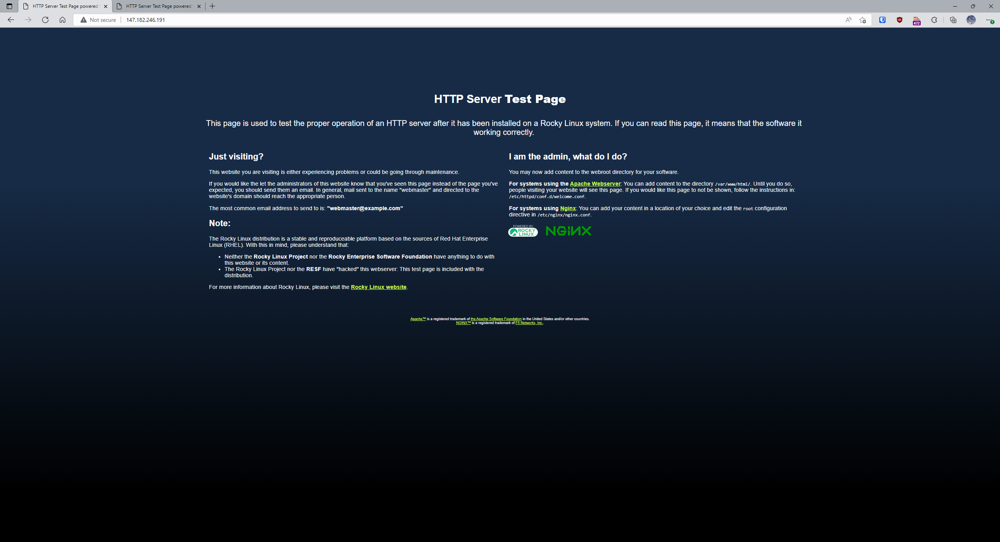

# 4640-trfrm2

Terraform must be installed before this can be run. Installation Instruction: https://developer.hashicorp.com/terraform/tutorials/aws-get-started/install-cli

Ansible must be installed as well. Installation Instructions: https://docs.ansible.com/ansible/latest/installation_guide/intro_installation.html

# This operates assuming the ssh key "River" is being used and that a project named "4640_labs" was created.
1. This assumes the key is found in the directories "/dev/River" and "/mgmt/River"

# If the ssh key name needs to be changed:
1. go to line 19 of "/dev/main.tf" change "name = "River"" to "name = <Insert key name here>"
2. Make sure that "/mgmt/inventory/group_vars/all" has line 3 "ansible_ssh_private_key_file: River" changed as well

# API key must be set for ansible
1. create a file containing " export DO_API_TOKEN=< INSERT API KEY HERE >" and source it

# Instructions for running the terraform
This should create and run 2 droplets tagged "Web" within the same VPC running rocky linux.

1. run terraform init
2. run terraform apply once all the above is completed
3. It will ask for an API key from digital ocean
4. Once entered it will create the required VM

# Ansible instructions
This should install nginx on the digital ocean droplets tagged "Web" and run the nginx service

1. ensure digitalocean plugin is installed with "ansible-galaxy collection install community.digitalocean"
2. once that is confirmed and the api token is set with the DO_API_TOKEN you can then run "ansible-playbook nginx_setup.yml -u root"

# Completed
It should appear as below once completed

